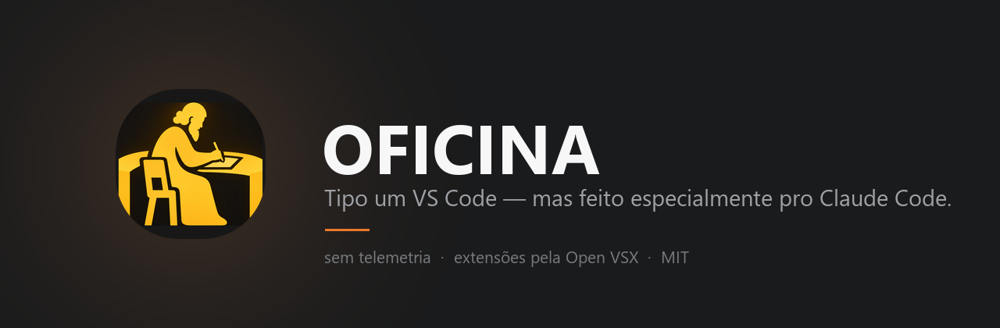
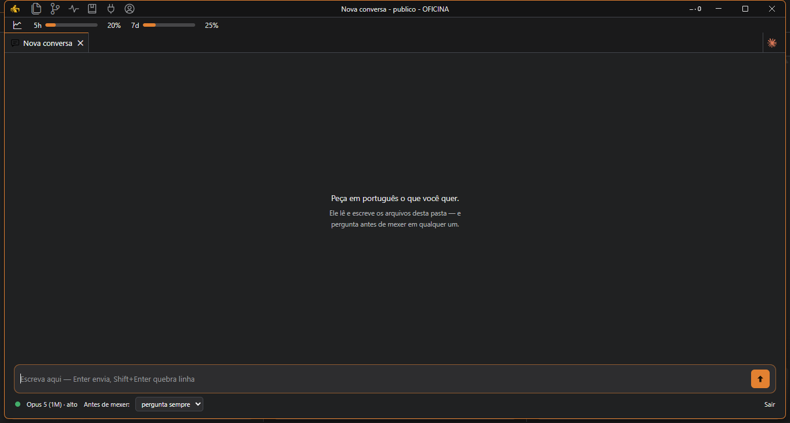
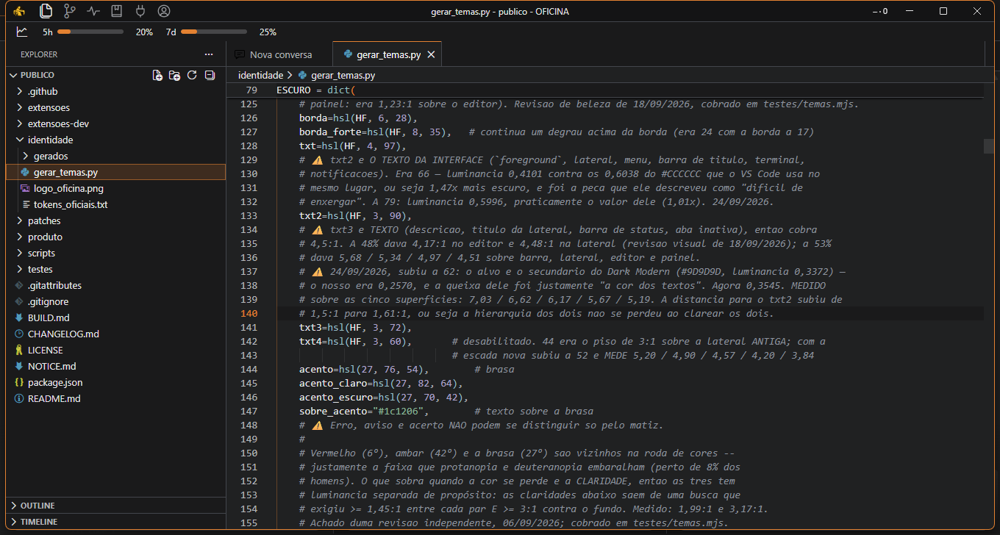
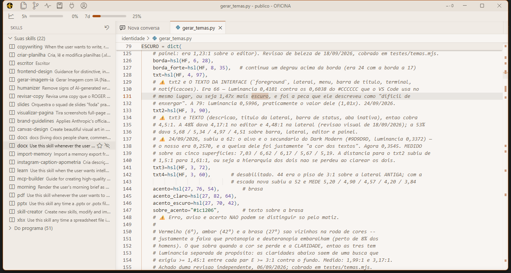

<p align="center">
  
</p>

<p align="center">
  <a href="../../releases"></a>
  
  <a href="LICENSE"></a>
  
  
</p>

---

**Tipo um VS Code — mas feito especialmente pro Claude Code.**

Mesmo núcleo open-source do
[Visual Studio Code](https://github.com/microsoft/vscode) (MIT), outra casa por dentro: o
agente não é uma extensão que você instala depois, é o motivo do programa existir. Abre a
pasta, pede em português, e a tela inteira já está montada em volta disso.

A OFICINA **não é** o Visual Studio Code. É uma compilação própria daquele núcleo, sem a
telemetria e sem as marcas do binário oficial da Microsoft. As extensões vêm da
[Open VSX](https://open-vsx.org), o registro aberto da Eclipse Foundation — a loja da
Microsoft, pelos termos dela, é só para os produtos dela.

<p align="center">
  
</p>

## O que muda em relação ao VS Code

|  |  |
|---|---|
| **A conversa é o programa** | O Claude Code não fica num painel lateral encaixado depois: é a tela principal, com atalho próprio e a janela montada em volta dele. |
| **Uma barra de cima com seis botões** | Arquivos, conversa, tokens, skills, conexões e conta — o que se usa o dia inteiro, sempre à mão, sem caçar em menu. |
| **Dois temas medidos, não escolhidos no olho** | Cada degrau de superfície é o primeiro valor que se separa do anterior por ΔL\* ≥ 3 no CIELAB. O contraste do texto é AAA, e o teste quebra se alguém afrouxar. |
| **Sem telemetria, sem loja fechada** | Nada sai da sua máquina. As extensões vêm da Open VSX. |

### Por dentro

<table>
<tr>
<td width="50%"><br><sub><b>O escuro.</b> A brasa é a única coisa quente da tela — marca foco, item ativo e cursor, e nada mais. Por isso a sintaxe é fria: se o código tivesse laranja, o acento pararia de significar alguma coisa.</sub></td>
<td width="50%"><br><sub><b>O claro.</b> Mesmo arquivo, mesma régua de contraste. Troca em <code>Ctrl+Shift+P</code> → "tema".</sub></td>
</tr>
</table>

## Estado

Em construção, versão por versão. O que existe hoje está no [CHANGELOG.md](CHANGELOG.md).

## Instalar

Baixe o `OficinaSetup.exe` na aba [Releases](../../releases) e abra. Ele instala sozinho,
sem pedir pasta nem privilégio de administrador.

**A primeira abertura precisa de internet.** O instalador leva o que pode ir embutido; o
Claude Code (que é proprietário e não pode ser redistribuído) e as demais extensões da lista
são baixados da Open VSX nessa hora, o Claude Code primeiro. Sem conexão, a OFICINA avisa e
tenta de novo na próxima abertura.

> **A tela azul "O Windows protegeu o computador" vai aparecer.** Clique em
> **"Mais informações" → "Executar assim mesmo"**. Ela aparece porque este instalador não
> tem certificado de assinatura de código pago — um custo recorrente que não compensa hoje
> —, não porque haja algo errado com o arquivo.

**Esta versão não se atualiza sozinha.** Para trocar de versão, baixe o instalador novo e
abra: ele instala por cima, sem desinstalar a anterior. O canal de atualização automática
existe no código (o programa sabe avisar, baixar e conferir o hash antes de aplicar), mas
depende de um endereço de distribuição, e esta compilação sai sem nenhum — um binário
público que busca atualização num servidor é um caminho por onde se entrega código a quem
baixou, e isso não se abre sem assinatura.

Cada Release traz, ao lado do instalador, o `.sha256.json` com o hash do arquivo:

```powershell
Get-FileHash .\OficinaSetup.exe -Algorithm SHA256
```

## ⚠️ O agente age sem pedir aprovação, de fábrica

A OFICINA vem configurada para o agente **editar arquivos e rodar comandos sem parar para
pedir licença** a cada passo. É o modo de trabalho que o dono do produto escolheu, e vale
desde a primeira mensagem.

**Na prática:** numa pasta sua, é velocidade. Numa pasta que você apenas abriu para olhar
— um repositório que você baixou, uma pasta de cliente, um pendrive — o agente lê os
arquivos daquele projeto, e instrução escondida dentro deles pode virar comando executado.
Não há, hoje, trava que limite o modo a pastas confiáveis — e, desde a v28, a OFICINA
também não pergunta se você confia na pasta ao abri-la (o Modo Restrito do VS Code desligava a
própria OFICINA). Para religar a pergunta: `"security.workspace.trust.enabled": true`.

Para trabalhar com aprovação a cada passo, troque o modo no seletor da conversa. A mudança
vale da próxima conversa em diante.

## Primeiro uso

1. **Abra uma pasta.** O agente trabalha nos arquivos dela, e as regras de permissão da
   pasta valem dentro do programa.
2. **Entre na sua própria conta do Claude.** A conversa mostra o caminho de entrada quando
   esta máquina ainda não entrou numa conta. A OFICINA não faz login por você, não guarda
   senha nem token, e não serve para usar a conta de outra pessoa. O ícone **Conta**, na
   barra de cima, diz em qual conta você está e é por onde se sai dela — quem guarda o
   login é o Claude, fora da OFICINA.
3. **Veja as suas conexões** no ícone **Conexões**, ao lado.
4. **Escolha o tema**, claro ou escuro, pela paleta de comandos (`Ctrl+Shift+P` → "tema").

## Quando algo não responde

`Ctrl+Shift+P` → **"OFICINA: Socorro"** (o mesmo botão aparece embaixo de todo erro da
conversa). Quatro ações separadas: reabrir a conversa, abrir o registro, mostrar a pasta
do registro e recarregar a janela. O registro anota erros e mudanças de estado, com a
hora, e **não** guarda o que você escreveu, nem a sua conta.

## Compilar

Veja [BUILD.md](BUILD.md). Resumo: Windows x64, Node na versão do `.nvmrc` da tag, Python
com `setuptools`, Visual Studio Build Tools com C++ (incluindo os componentes Spectre) — e
então `scripts\construir.bat`.

## Licença

MIT — veja [LICENSE](LICENSE) e os avisos de origem em [NOTICE.md](NOTICE.md). O núcleo do
VS Code é MIT © Microsoft Corporation; as marcas "Visual Studio Code" e o ícone oficial
**não** são MIT e não são usados aqui.

## Sem suporte

Este repositório é publicado como está, sem garantia e **sem suporte**. Se a OFICINA for
útil para você, ótimo; se quebrar, os dois pedaços são seus.

---

<sub><b>English:</b> Like VS Code — but built specifically for Claude Code. OFICINA is an
editor compiled from the open-source core of Visual Studio Code (MIT), with the agent as
the main surface rather than a side panel, and a Portuguese-language interface. It is not
Visual Studio Code: it is an independent build with its own name, identity and defaults,
no Microsoft telemetry and no Microsoft branding. Extensions come from Open VSX. Provided
as is, <b>without support</b>.</sub>
